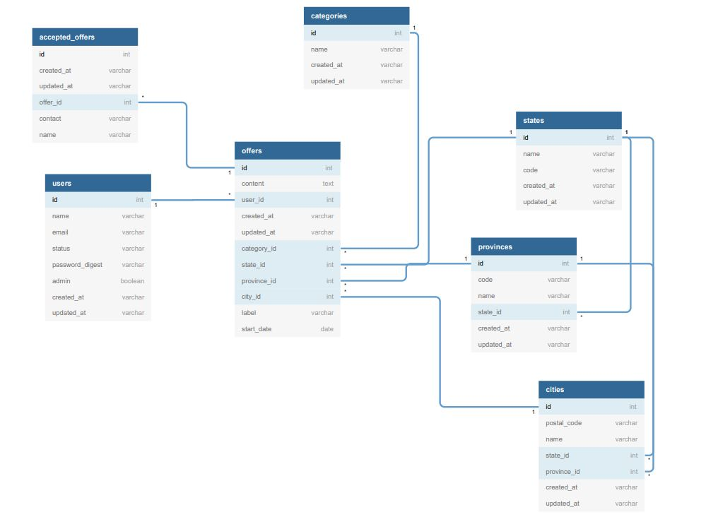

# DOKUMENTÁCIA
Predmet: Datázové systémy\
Meno a priezvisko: Andrej Petričko

## Stručný opis projektu
Projekt je realizovaný ako vebová aplikácia, ktorá má slúžiť ako inzercia krátkodobých pracovných ponúk. 
Používatelia si tu môžu nájsť ponuku podľa toho kde a kedy by ju chceli.

## Databáza
Databáza obsahuje celkom 9 tabuliek z toho 2 boli automaticky vygenerované.
Nasledujúci obrázok ukazuje vzťahy zvyšných siedmich zatabuľiek


## Scenáre
#### Vytvorenie nového záznamu,
Vytvorenie záznamu je zahrnuté v dvoch fuknciách. \
\
Prvou je registrácia používateľa. Používateľ si môže na stránke vytvoriť 
svoje konto, pomocou ktorého môže neskôr vytvárať pracovné ponuky. \
Registrovať sa dá na domovskej stránke, kde je tlačidlo "**sign in**". 
Po stlačení tlačidla je používateľ presmerovaný na registračný formulár. 
Tu vyplní potrebné údaje a po stlačení tlačidla "**register**" sa skontrolujú
 údaje a vytvorí sa jeho profil.\
\
Druhou funkciou je spomenuté vytvorenie ponuky. Používateľ si po registrácii 
a prihlásení v hlavnom menu vyberie možnosť "**Create offer**". Následne je 
presmerovaný na formulár vytvorenia novej ponuky. Tu vyplní údaje a následne 
potvrdí vytvorenie.

#### Zobrazenie konkrétneho záznamu - detail,
Bez prihlásenia sa dá iba zobraziť detail vybranej pracovej ponuky. Po 
zobrazení detailu vidí používateľ detailne info o pracovej ponuke. V pravej 
časti obrazovky má formulár prihlásenia na vybranú pracovnú ponuku. Prihlasovanie 
funguje na princípe, že používateľ zadá svoje meno a kontakt na seba a po stlačení 
tlačidla sa zadané údaje nahrajú do systému.\
\
Po prihlásení si vie používateľ zobraziť detail svojho profilu alebo detail jeho 
vytvorených ponúk, kde vidí podrobné informácie o ponuke a zoznam prihlásených 
používateľov. 

#### Vymazanie záznamu
Používateľ vie zmazať jednotlivé pracovné ponuky. Pri zobrazení detailu ponuky v 
pravej časti sa nachádza tlačidlo "**Delete offer**". \
\
Používateľ vie tak isto zmazať aj svoj profil. V navigačnom panely cez tlačidlo 
"**Acount**" a nasledne možnosť setings. A následne sa zobrazí formulár úpravy 
profilu, kde sa v dolnej časti nachádza možnosť "**Delete account**". Po vymazaní
profilu sa vymažú aj pracovné ponuky spojené s ním.\
\
Admin stránky vie v zobrazení používateľov zmazať vybraného používateľa. 

#### Aktualizácia existujúceho záznamu,
Používateľ si vie aktualizovať informácie o svojom profile v nastaveniach svojho profilu.

#### Zobrazenie prehľadu všetkých záznamov 
_(rozumne stránkovaných, ak je to potrebné), kde v každom riadku figuruje aspoň
 jedno číslo, pre ktorého výpočet sa využíva GROUP BY (malo by ísť o vybranú 
 relevantnú doménovú štatistiku),_

Používateľ vie prejsť na štatistické zobrazenie ponúk. Može ich zobraziť vrámci
kategórie alebo štátu. Podľa toho sa mu zobrazí zoznam ponúk pre jeho výber.
Pri štátoch si vie používateľ zobraziť ešte detailne podľa miest v zvolenom štáte.

   
###### rozširujúci podscenár: 
##### Filtrovanie záznamov spĺňajúcich určité kritériá zadané používateľom.
Používateľ vie prehľadávať ponuky podľa jeho zadaných parametrov. Na domovskej 
sa mu zobrazí vyhľadávací formulár kde môže zadať štát alebo mesto v ktorom 
chce nájsť ponuky a vybrať časové rozmedzie od kedy do kedy by chcel prácu.\
Následne sa mu zobrazí okno vyhľadávania s výsledkami, kde môže vyhľadávanie
zopakovať a má na výber ešte filtrovať podľa kategórie.


## Optimalizácia

Optimalizáciu querry volaní som robil najmä pomocou indexov. Tie mi zrýchlili
načitávania z databázy niekedy aj o 40-50 sekúnd. A však v prípade JOINov som
musel optimalizovať aj kód volania, pretože potom často WHERE nemohol použiť
index.

Napríklad pri takomto kóde sa indexy nedali použiť. 
```
@offers = Offer.select("offers.*, categories.name as cat_name, states.name as s_name, cities.name as c_name")
                       .joins("LEFT JOIN categories ON categories.id = offers.category_id")
                       .joins("LEFT JOIN states ON states.id = offers.state_id")
                       .joins("LEFT JOIN cities ON cities.id = offers.city_id")
                       .where("states.name = ? OR cities.name = ? and date BETWEEN ? and ?",
                               params[:search], params[:search], params[:date_start], params[:date_end])
                       .order(:date)
                       .paginate(page: params[:page], per_page: 10)
```
Avšak ak som namiesto LEFT JOIN použil INNER JOIN kde where podmienka bola 
skrytá vnútri,tak databáza najprv využila index a potom spojila tabuľky.
To ma naučilo že použitie  WHERE na tabuľky, ktoré sú časťou LEFT JOIN
je oveľa pomalšie ako použitie INNER JOIN na tabuľku vo vtnútri ktorej bol
použitý WHERE.

